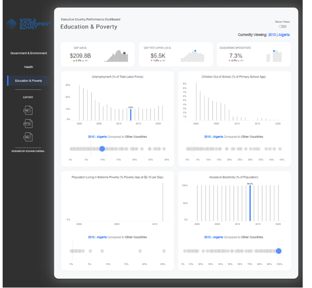
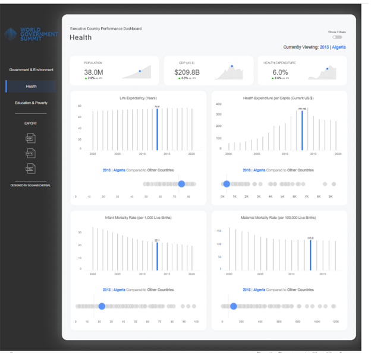
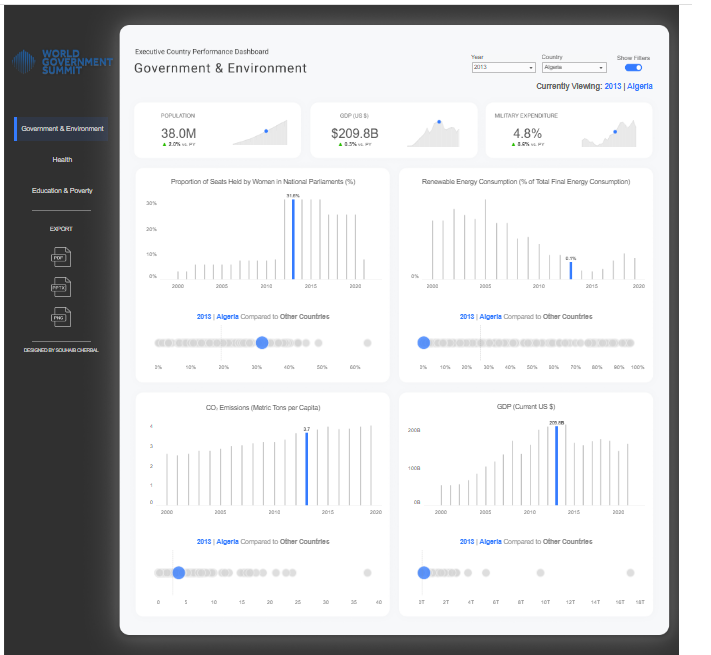

# Executive Country Performance Dashboard

This project is a Tableau Desktop dashboard visualizing key performance indicators (KPIs) for Algeria across various sectors, including Education, Poverty, Health, and Government & Environment. The dashboard was designed for the World Government Summit, showcasing data from 2013 for Algeria with comparisons to other countries.

## Table of Contents
- [Project Overview](#project-overview)
- [Dashboard Features](#dashboard-features)
- [Installation](#installation)
- [Data Sources](#data-sources)
- [Usage](#usage)
- [Screenshots](#screenshots)
- [Contributing](#contributing)
- [License](#license)

## Project Overview
The Executive Country Performance Dashboard provides a comprehensive visual analysis of various socio-economic and environmental metrics. It aims to present an easily interpretable overview of the state and progress in key areas, allowing policymakers and researchers to make informed decisions.

The metrics visualized in the dashboard include:
- **GDP**: Total GDP and GDP per capita
- **Unemployment Rate**: Proportion of unemployed individuals in the labor force
- **Children Out of School**: Percentage of children not attending primary school
- **Extreme Poverty**: Percentage of population living on less than $2.15 per day
- **Access to Electricity**: Proportion of population with access to electricity
- **Life Expectancy**: Average life expectancy in years
- **Health Expenditure**: Spending on health per capita
- **Infant and Maternal Mortality Rates**
- **Proportion of Seats Held by Women**: Representation of women in national parliaments
- **CO₂ Emissions**: Carbon dioxide emissions per capita
- **Renewable Energy Consumption**

## Dashboard Features
- **User-Friendly Interface**: Allows for easy navigation through various indicators.
- **Comparative Analysis**: Each indicator displays a comparison between Algeria and other countries.
- **Interactive Visuals**: Each chart is interactive, enabling users to examine trends over time.
- **Data Filters**: Options to filter data by year and country.

## Installation
1. Clone this repository to your local machine:
   ```bash
   git clone https://github.com/Souhaib-Cherbal/Country-Performance-Dashboard.git
   ```
2. Open the `.twbx` file in Tableau Desktop.
3. Ensure the data source is connected properly if it requires any updates.

## Data Sources
The data visualized in this dashboard is sourced from reliable international organizations and datasets, such as:
- The World Bank
- United Nations
- World Health Organization
- International Energy Agency

## Usage
1. Open the Tableau `.twbx` file in Tableau Desktop.
2. Navigate through the different tabs to explore indicators by sector: **Health**, **Education & Poverty**, and **Government & Environment**.
3. Use the filters on the dashboard to view data from different years or other comparative countries.

## Screenshots
### Education & Poverty


### Health


### Government & Environment


## Contributing
Contributions are welcome! Please follow these steps:
1. Fork the repository.
2. Create a new branch for your feature.
3. Submit a pull request detailing your changes.

## License
This project is licensed under the MIT License.
